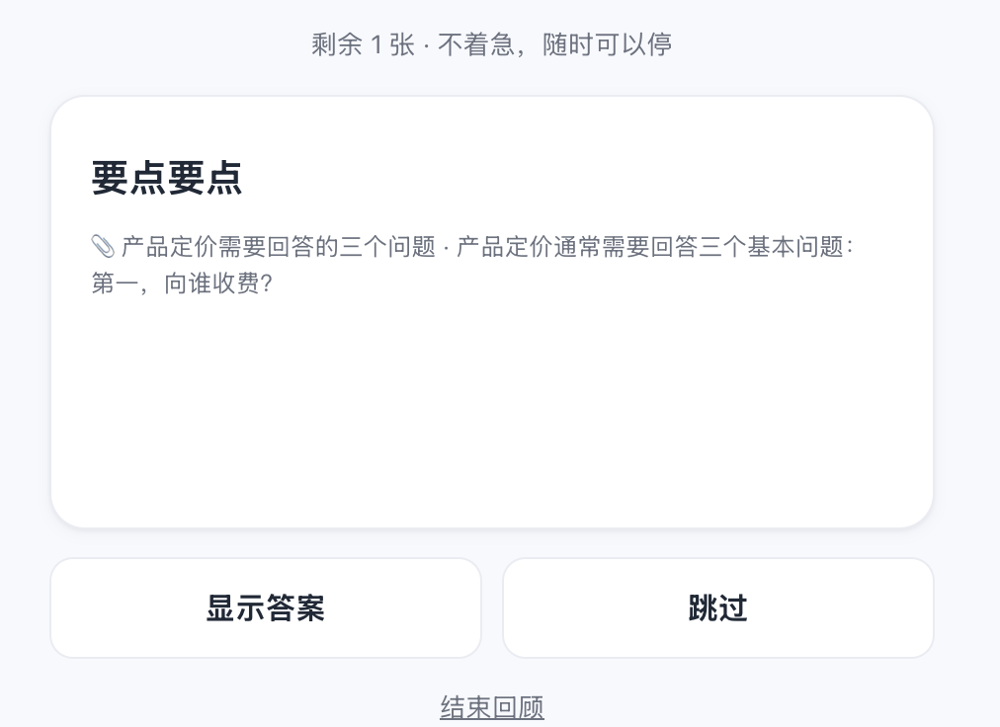
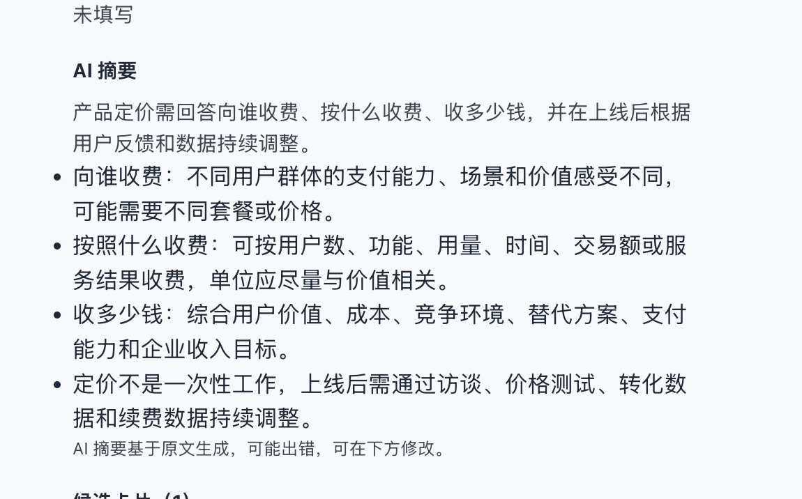

# 先存着 · AI 知识卡片工具（MVP）

> 把真正想记住的内容输入进来，AI 帮你整理成知识卡片，并在合适的时候帮助你回顾。
> 基于 [PRD v0.4](./PRD-v0.4.md) 调整方向后的可运行版本。

## 项目简介

「先存着」是一款面向个人学习和信息整理的 AI 知识卡片工具。用户可以把文章、笔记或网页内容先保存下来，系统再提炼核心知识、生成带问题的回顾卡片，并通过间隔回顾帮助用户真正记住内容。

它解决的是“收藏了很多，但之后没有真正记住”的问题：保存和处理分离，原文始终保留，AI 结果可以人工修改，回顾时只呈现一个需要主动回忆的问题。

## 主要功能

- **先保存，再处理**：正文、标题、来源链接和保存原因可以按需填写，保存后再异步生成摘要和候选卡片。
- **AI 核心总结**：根据原文提炼面向卡片回顾的核心知识点，支持 OpenAI 兼容模型，也有规则模式作为无 Key 时的降级方案。
- **问题型知识卡片**：自动生成问答、概念和填空卡片；用户可以确认、编辑、删除、暂停或重新生成。
- **低压力回顾**：答案默认隐藏，支持“忘了 / 模糊 / 记得 / 很熟”反馈，并据此安排下一次回顾。
- **原文与来源管理**：详情页可展开原文、查看 AI 总结和来源标题，方便回到上下文核对。
- **体验模式**：登录页支持跳过注册直接体验，体验账号与正式账号数据隔离。
- **个人数据控制**：支持搜索、筛选、导出、清空和注销，默认按账号隔离保存。

## 技术栈

- 前端：HTML、CSS、原生 JavaScript，基于 URL Hash 的单页应用
- 后端：Node.js 22.5+，使用 Node 内置 HTTP 服务
- 数据库：SQLite（Node 内置 `node:sqlite`）
- AI：OpenAI API 及其他 OpenAI 兼容协议服务
- 测试：Node.js 自测脚本和端到端 API 测试
- 依赖：零运行时 npm 依赖，无需前端构建工具

## 界面截图

### 回顾卡片



### 知识详情与 AI 总结



## 核心闭环

> 输入或粘贴内容 → 立即保存原文 → AI 生成摘要和候选卡片 → 用户确认/编辑/删除 → 进入个人知识库 → 低压力回顾

## 页面结构（4 个底部 Tab）

`回顾` 为第一入口（今日待回顾 + 开始回顾 + 最近确认/最近回顾）；`知识库` 内部分「内容 / 卡片」两个视图，统一管理输入内容和已确认卡片；`添加` 负责录入新内容（正文为核心，标题/链接/保存原因/内容类型均可选）；`我的` 负责统计、回顾偏好、数据导出、清空、注销等设置。

## 已实现（对照 PRD v0.4）

- **内容输入（P0）**：正文为核心输入，标题/来源链接/保存原因均为可选；只填链接也能先保存，但摘要和卡片只基于正文生成，不依赖外部解析。
- **先保存再处理**：保存立即成功，AI 摘要与候选卡片异步生成；解析失败不影响原文，可重试。
- **AI 理解**：规则模式摘要、分类、标签、要点兜底；配置 API Key 后自动升级为 LLM 生成。
- **知识卡片（P0）**：知识类内容自动生成 1-3 张候选卡片；支持确认、编辑、删除、暂停/恢复、归档、手动创建、重新生成；未确认卡片不进入回顾。
- **低压力回顾（P0）**：答案默认隐藏、点击展开；反馈（忘了/模糊/记得/很熟）驱动下次回顾时间；随时可停，无打卡无逾期。
- **数据（P0）**：默认私密、按用户隔离、单条删除、一键清空全部数据、全量导出。
- **来源链接（降级定位）**：仅作为补充信息保存，详情页可打开原文；不要求系统成功访问或解析链接。
- **快捷指令收录**：iPhone 快捷指令 POST `/api/shortcut`，凭令牌写入。

仍保留的探索能力（非 MVP 依赖）：网页链接异步解析（小红书元数据、通用页面正文）、关键词/自然语言搜索、收藏集与发现页。

## 快速开始

依赖：Node.js ≥ 22.5（自带 SQLite 模块，无需 `npm install`）。

```bash
# 下载代码
git clone https://github.com/sunnyzhoumo-jasmine/xiancunzhe.git
cd xiancunzhe

# 方式一：直接启动
node server/index.js

# 方式二：使用启动脚本自动查找 Node.js
./run.sh

# 方式三：指定端口与数据目录
PORT=8080 DATA_DIR=./data node server/index.js
```

启动后访问 http://localhost:3000 ，注册一个本地账号即可使用。数据保存在 `data/app.db`（SQLite），完全离线可用。

如果登录页出现“跳过登录，先体验一下”，可以直接进入独立体验空间，无需注册正式账号。

## 配置 AI（可选）

不配置也能使用基础功能：摘要、分类和搜索会走规则模式。配置后启用 LLM 增强。请在启动服务的**同一个终端**中设置变量，不要把真实 Key 写进代码或提交到 GitHub：

```bash
export OPENAI_API_KEY="sk-your-key-here"
export OPENAI_BASE_URL="https://api.openai.com/v1"
export OPENAI_MODEL="gpt-4o-mini"
node server/index.js
```

使用其他 OpenAI 兼容服务时，只需替换 `OPENAI_BASE_URL` 和 `OPENAI_MODEL`。模型名称必须与服务商 `/v1/models` 返回的 ID 完全一致，例如：

```bash
export OPENAI_BASE_URL="https://your-provider.example/v1"
export OPENAI_MODEL="your-model-id"
```

启动日志显示 `AI 模式：已启用（模型名）` 后，才表示当前服务进程已读取到 Key 并启用模型。`.env`、数据库和本地数据目录已加入 `.gitignore`，不会随代码提交。

AI 结果遵循 PRD 原则：只依据来源内容，可在详情页修改。

## 在线体验

- GitHub 源码：[sunnyzhoumo-jasmine/xiancunzhe](https://github.com/sunnyzhoumo-jasmine/xiancunzhe)
- 在线体验：待部署后补充（请将此处替换为稳定的 HTTPS 地址）
- 本地体验：http://localhost:3000

公网部署时，建议使用 HTTPS，并在部署平台的环境变量中配置 `OPENAI_API_KEY`、`OPENAI_BASE_URL` 和 `OPENAI_MODEL`，不要把 Key 放在前端代码或 README 中。

## iPhone 快捷指令收录

1. 打开「快捷指令」App → 新建快捷指令 → 添加操作「接收共享内容」，类型选「URL / 链接」。
2. 添加操作「获取 URL 内容」：
   - URL：`你的服务器地址/api/shortcut`（本机调试可先用电脑局域网 IP，如 `http://192.168.1.5:3000/api/shortcut`）
   - 方法：POST
   - 请求体 → JSON：`{"url":"输入"}`
   - 请求头：`X-Auth-Token` 填「我的」页显示的令牌
3. 任意 App 中点「分享」→ 你的快捷指令，即可一键存到先存着。

## 测试

```bash
node scripts/selfcheck.js   # 后端逻辑自测（24 项）
node scripts/e2e.js         # 端到端自测（静态页 + API）
```

## 部署提示

- 供手机/外部访问时请用 HTTPS（建议反代 Nginx/Caddy），否则快捷指令和登录态会受限。
- 纯文本/图片链接的收藏始终可解析；部分平台（小红书、抖音等）对爬虫有限制，抓不到正文时会标记「部分解析」或「仅保存链接」，符合 PRD 预期。
- 正式对外前建议：备份 `data/`、设置强密码、限制注册。

## 目录结构

```
server/         后端（零依赖，Node 内置模块）
  index.js      入口与静态服务
  routes.js     API 路由与异步处理
  db.js         SQLite 数据层
  auth.js       账号与会话
  parser.js     链接抓取、元数据、规则分类
  ai.js         可选 LLM 增强（OpenAI 兼容）
  cards.js      候选卡片与回顾调度
public/         移动端 Web 前端（原生 JS，无构建）
docs/screenshots/  README 展示截图
scripts/        自测脚本
PRD-v0.2.md     产品需求文档
PRD-1page.md    一页纸 PRD
PRD-指标与验收口径.md  指标与验收量化口径
```
